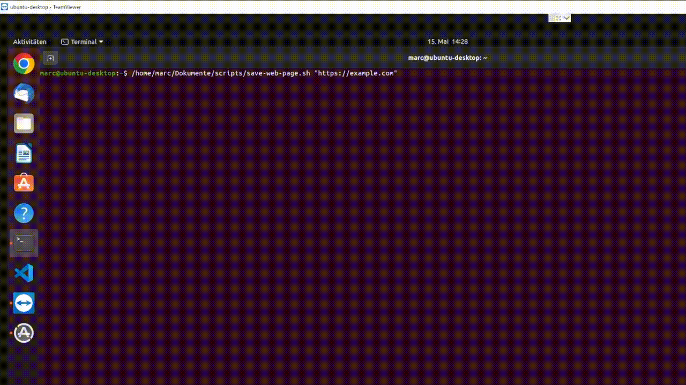

# wgetg
This is an alternative to `wget` or `curl`, which opens an URL in a graphical browser and returns it html source or saves the web page as html file. By that the html source code contains interactive changes made by javascript.

**Demo:**



**Example: Open URL and return html source code**

By default wgetg opens the URL with firefox or chromium and returns the html source code of the web page.

```
$ ./wgetg https://example.com
<!doctype html>
<html>
<head>
    <title>Example Domain</title>

    <meta charset="utf-8" />
    <meta http-equiv="Content-type" content="text/html; charset=utf-8" />
    <meta name="viewport" content="width=device-width, initial-scale=1" />
...
```

**Example: Open URL with specific browser and save web page as HTML file with timestamp and page title in filename**

If a directory is set as `--outfile` ( `-o`), the filename will be "YYYY-MM-DDTHH-MM-SS.html" and the script returns this filename. If the `--title` (`-t`) option is set, it even adds the web page title to the filename.

```
$ ./wgetg -t -b "google-chrome" -o "/home/foo" https://example.com
/home/foo/2022-05-15T12-55-01 Example Domain.html
```

**Options**

Use `--help` (`-h`) to display all available options:

```
$ ./wgetg -h
...
  options:
   -b, --browser       Executable browser name like "chromium", default is "firefox"
   -o, --output        Destination file like /home/foo/bar.html or directory like /home/foo (filename becomes YYYY-MM-DDTHH-MM-SS.html)
   -t, --title         Add web page title to filename
   -w, --wait          Give the browser X seconds to load before saving the page, default is "4"
   -v, --verbose       Explain what is being done
```

**Requirements**
 - Linux desktop environment
 - A browser like Firefox
 - xdotool
 - xprop
